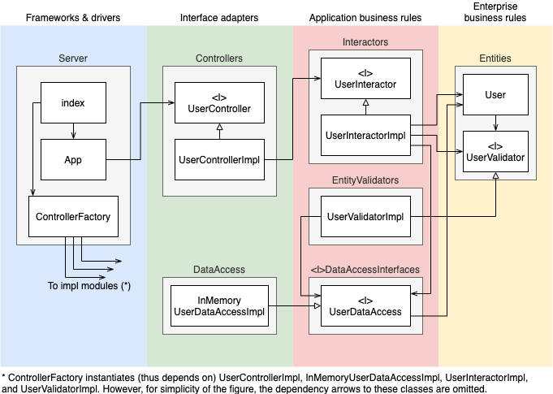

# Clean architecture example API server (typescript + express)

[](https://github.com/nakaakist/clean-architecture-example-typescript/actions/workflows/main.yml)

## About

This is a simple API server for CRUD of users
as an example of [the clean architecture](https://blog.cleancoder.com/uncle-bob/2012/08/13/the-clean-architecture.html).

In addition to simple CRUD functions, this API server implements API request validations.
It is designed that **each validation is conducted in an appropriate architectural layer**.

## How to use

### Start server

Type `yarn install` and `yarn start` at the root directory.
The server starts at port 8000.

### Available endpoints

Available endpoints and example requests are the following. (Note that an initial user exists with name "initial-user" even before creating a user).

- Create user

```
curl -X POST localhost:8000/users -H 'Content-Type:application/json' -d '{"name": "hoge"}'
```

- List all users

```
curl -X GET localhost:8000/users
```

- Find user by ID (replace <USER ID> with an appropriate value)

```
curl -X GET localhost:8000/users/<USER ID>
```

- Update user

```
curl -X PUT localhost:8000/users/<USER ID> -H 'Content-Type:application/json' -d '{"name": "fuga"}'
```

- Delete user

```
curl -X DELETE localhost:8000/users/<USER ID>
```

### Unit test

Type `yarn test` at the root directory to run unit tests.

## Design notes

### Components

The following figure shows the components and classes in this system.


The dependencies among components are designed to obey the "dependency rule" of the clean architecture.
